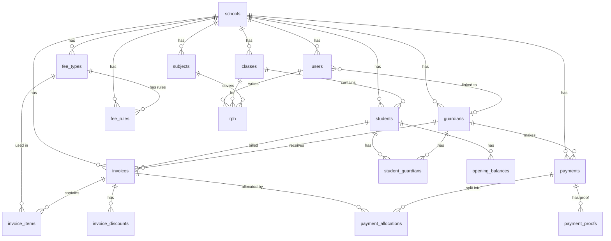

# 📘 FINAL SYSTEM DESIGN
## SRITI School Management System

**Version**: 1.0 | **Date**: April 2026 | **Prepared by**: SwiftApps

---

## 1. 🔐 Users & Authentication

Semua user login melalui Supabase Auth.

```
users
- id             (= auth.uid)
- school_id      → schools
- guardian_id    (nullable → guardians)
- full_name
- email
- role           (super_admin | staff | parent)
- is_active
- created_at
```

**Logic:**
- `parent` → linked ke `guardian_id`
- `staff` / `super_admin` → `guardian_id` = null
- Semua access control based on `role`

---

## 2. 🏫 Multi-Tenancy

Semua table utama ada `school_id`. Data setiap sekolah terasing sepenuhnya.

---

## 3. 🏫 Schools

```
schools
- id
- name
- code
- address
- phone
- logo_url
- status         (active | inactive)
- created_at
```

---

## 4. 👨‍🎓 Students & Guardians

```
students
- id
- school_id      → schools
- student_no
- full_name
- year_level
- class_id       → classes
- status         (active | inactive)
- created_at

guardians
- id
- school_id      → schools
- full_name
- phone
- email
- created_at

student_guardians
- id
- school_id      → schools
- student_id     → students
- guardian_id    → guardians
- relationship   (ayah | ibu | penjaga)
- is_primary
```

---

## 5. 🏫 Classes & Subjects

```
classes
- id
- school_id      → schools
- name           (Tahun 1 Arif, Tahun 2 Bestari)
- year_level

subjects
- id
- school_id      → schools
- name           (Matematik, Bahasa Melayu, Pendidikan Islam)
```

---

## 6. 💰 Fee System

```
fee_types
- id
- school_id      → schools
- name           (Yuran Bulanan, Yuran Tahunan, Pendaftaran, Buku, Uniform)
- type           (monthly | annual | one_time | item)
- is_active

fee_rules
- id
- school_id      → schools
- fee_type_id    → fee_types
- year_level
- amount
- effective_from
- effective_to   (null = berlaku sehingga ditukar)
- is_active
```

**Note:** `effective_from` / `effective_to` adalah source of truth untuk harga.

---

## 7. 🧾 Invoice System

```
invoices
- id
- school_id      → schools
- student_id     → students
- guardian_id    → guardians
- invoice_no     (INV-2026-0001)
- invoice_month
- invoice_year
- total_amount
- discount_amount
- status         (draft | sent | pending | paid | overdue)
- created_at
```

**Computed fields (NOT stored):**
```
paid_amount    = SUM(payment_allocations.amount) WHERE invoice_id
balance_amount = total_amount - discount_amount - paid_amount
```

---

## 8. 📦 Invoice Items

```
invoice_items
- id
- school_id      → schools
- invoice_id     → invoices
- fee_type_id    → fee_types
- description
- quantity
- unit_price
- amount
- price_snapshot  (capture harga semasa invoice dijana)
```

---

## 9. 🎯 Invoice Discounts

```
invoice_discounts
- id
- school_id      → schools
- invoice_id     → invoices
- type           (ramadan | sibling | manual_adjustment)
- amount
- note
- created_at
```

---

## 10. 💳 Payments

```
payments
- id
- school_id      → schools
- guardian_id    → guardians
- amount
- payment_date
- method         (fpx | manual_transfer | qr | cash)
- status         (pending | success | failed | rejected)
- reference_no
- gateway_reference
- created_at
```

---

## 11. 🔗 Payment Allocations

Untuk support bayaran satu amaun kepada beberapa invoice (multi-student).

```
payment_allocations
- id
- school_id      → schools
- payment_id     → payments
- invoice_id     → invoices
- amount
- created_at
```

---

## 12. 📎 Payment Proofs

```
payment_proofs
- id
- school_id      → schools
- payment_id     → payments
- file_url       (Supabase Storage)
- uploaded_at
- verified_by    → users
- verified_at
- verification_note
```

---

## 13. 📊 Opening Balances (Data Migration)

```
opening_balances
- id
- school_id      → schools
- student_id     → students
- amount_due     (total sepatutnya Jan–Apr)
- amount_paid    (total dah bayar sebelum sistem)
- balance        (tunggakan dibawa masuk)
- as_of_date     (2026-04-30)
- note
```

---

## 14. 📘 RPH Module (Phase 3)

```
rph
- id
- school_id      → schools
- teacher_id     → users
- class_id       → classes
- subject_id     → subjects
- date
- topic
- objective
- activity
- reflection
- status         (draft | submitted | approved | revision)
- reviewer_comment
- content_json   (optional structured data)
- created_at
```

---

## 15. 🔁 Payment Flow

### Gateway (Auto)
```
Parent bayar → Redirect Gateway → Webhook → payments.status = success
→ payment_allocations created → invoice.status = paid
```

### Manual (Semi-auto)
```
Parent upload bukti → payment_proofs created → payments.status = pending
→ Admin verify → payments.status = success
→ payment_allocations created → invoice.status = paid
```

---

## 16. 🧠 Design Principles

1. Multi-tenant from day 1 (`school_id` everywhere)
2. FK over string enum (consistency)
3. Computed fields over stored (accuracy, no sync bugs)
4. Flexible payment allocation (partial + multi-student)
5. Audit-friendly (invoice_discounts + payment_proofs)
6. Role-based access (super_admin | staff | parent)
7. Price snapshot on invoice_items (data integrity)

---

## 17. 🚀 Final Summary

| Component | Decision |
|-----------|----------|
| Users/Auth | Supabase Auth + users table |
| Multi-tenancy | school_id on all tables |
| Student-Class | FK → classes table |
| Student-Guardian | Many-to-many |
| Invoice | Per student |
| Paid Amount | Computed (NOT stored) |
| Fee Type | FK → fee_types table |
| Fee Rules | effective_from / effective_to |
| Discounts | Separate invoice_discounts table |
| Payment | Per guardian |
| Payment Allocation | Supported (multi-student, partial) |
| Payment Proof | Separate table + Supabase Storage |
| Opening Balance | Separate table for migration |
| RPH | Structured fields + FK |

---

## 18. 📊 ERD Diagram



---

*Prepared by SwiftApps | swiftapps.my*
*Schema Version: 1.0 | Ready for development*
