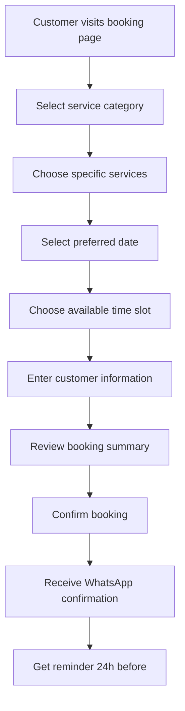

# 🗓️ SwiftSalon Booking System Architecture
*Complete booking system design for Muslimah salon management*

## 🎯 **System Overview**

The booking system is the core functionality that allows customers to schedule appointments and enables salon staff to manage their daily operations efficiently.

### **Key Features**
- **Customer Booking Interface** - Easy appointment scheduling
- **Staff Availability Management** - Real-time slot management
- **Service Selection** - Choose from salon service menu
- **Time Slot Management** - Prevent double bookings
- **WhatsApp Integration** - Booking confirmations and reminders
- **QR Code Booking** - Quick access booking system

---

## 🏗️ **Technical Architecture**

### **Frontend Components (Next.js 15 + React)**

```typescript
// Component Structure
src/
├── app/
│   ├── booking/
│   │   ├── page.tsx                 // Main booking interface
│   │   ├── confirm/page.tsx         // Booking confirmation
│   │   └── success/page.tsx         // Booking success page
│   ├── admin/
│   │   ├── bookings/
│   │   │   ├── page.tsx             // Booking management dashboard
│   │   │   ├── calendar/page.tsx    // Calendar view
│   │   │   └── [id]/page.tsx        // Individual booking details
│   │   └── schedule/page.tsx        // Staff schedule management
│   └── api/
│       ├── bookings/
│       │   ├── route.ts             // CRUD operations
│       │   ├── available-slots/route.ts // Available time slots
│       │   └── confirm/route.ts     // Booking confirmation
│       ├── services/route.ts        // Service management
│       └── staff/route.ts           // Staff management
├── components/
│   ├── booking/
│   │   ├── ServiceSelector.tsx      // Service selection component
│   │   ├── TimeSlotPicker.tsx       // Time slot selection
│   │   ├── CustomerForm.tsx         // Customer information form
│   │   ├── BookingSummary.tsx       // Booking confirmation summary
│   │   └── CalendarView.tsx         // Calendar interface
│   ├── admin/
│   │   ├── BookingCard.tsx          // Individual booking display
│   │   ├── DayView.tsx              // Daily schedule view
│   │   └── StaffSchedule.tsx        // Staff availability management
│   └── shared/
│       ├── DatePicker.tsx           // Date selection component
│       └── LoadingSpinner.tsx       // Loading states
└── lib/
    ├── booking-utils.ts             // Booking business logic
    ├── time-utils.ts                // Time calculation utilities
    └── validation.ts                // Form validation schemas
```

### **Backend API Design (Next.js API Routes)**

```typescript
// API Endpoint Structure

// GET /api/services - Get available services
interface Service {
  id: string;
  name: string;
  description: string;
  duration: number; // minutes
  price: number;    // RM
  category: 'HAIR' | 'FACIAL' | 'HENNA' | 'SPA' | 'NAIL';
}

// GET /api/bookings/available-slots - Get available time slots
interface AvailableSlotRequest {
  date: string;        // YYYY-MM-DD
  serviceId: string;
  staffId?: string;    // Optional staff preference
}

interface AvailableSlot {
  startTime: string;   // HH:MM
  endTime: string;     // HH:MM
  staffId: string;
  staffName: string;
}

// POST /api/bookings - Create new booking
interface CreateBookingRequest {
  customerId?: string;  // Existing customer
  customerData?: {      // New customer
    name: string;
    phone: string;
    email?: string;
  };
  serviceIds: string[];
  date: string;         // YYYY-MM-DD
  startTime: string;    // HH:MM
  staffId: string;
  notes?: string;
}

interface BookingResponse {
  id: string;
  bookingReference: string;
  customer: Customer;
  services: Service[];
  date: string;
  startTime: string;
  endTime: string;
  staff: Staff;
  totalAmount: number;
  status: 'PENDING' | 'CONFIRMED' | 'COMPLETED' | 'CANCELLED';
}

// PUT /api/bookings/[id] - Update booking status
interface UpdateBookingRequest {
  status: 'CONFIRMED' | 'COMPLETED' | 'CANCELLED' | 'NO_SHOW';
  paymentMethod?: 'CASH' | 'QR_PAY' | 'FPX';
  notes?: string;
}
```

---

## 🎨 **User Interface Design**

### **Customer Booking Flow**



### **Booking Interface Wireframe**

```markdown
┌─────────────────────────────────────────────────────────┐
│                 🌸 SwiftSalon Muslimah                  │
│                   Tempahan Online                       │
├─────────────────────────────────────────────────────────┤
│                                                         │
│  📋 Pilih Servis:                                      │
│  ┌─────────────┐ ┌─────────────┐ ┌─────────────┐      │
│  │   Rambut    │ │   Wajah     │ │   Inai      │      │
│  │   RM25-45   │ │   RM80-120  │ │   RM25-30   │      │
│  └─────────────┘ └─────────────┘ └─────────────┘      │
│                                                         │
│  📅 Pilih Tarikh:                                      │
│  [Date Picker Component]                                │
│                                                         │
│  ⏰ Pilih Masa:                                        │
│  ┌───────┐ ┌───────┐ ┌───────┐ ┌───────┐              │
│  │ 09:00 │ │ 10:30 │ │ 14:00 │ │ 15:30 │              │
│  └───────┘ └───────┘ └───────┘ └───────┘              │
│                                                         │
│  👤 Maklumat Pelanggan:                                │
│  Nama: [________________]                               │
│  Telefon: [________________]                            │
│  Email: [________________] (optional)                   │
│                                                         │
│  💰 Jumlah: RM45.00                                    │
│                                                         │
│            [Sahkan Tempahan]                           │
│                                                         │
└─────────────────────────────────────────────────────────┘
```

---

## ⚙️ **Business Logic Implementation**

### **Time Slot Calculation Algorithm**

```typescript
// lib/booking-utils.ts

interface TimeSlot {
  start: Date;
  end: Date;
  staffId: string;
}

export class BookingService {
  /**
   * Calculate available time slots for a given date and service
   */
  async getAvailableTimeSlots(
    date: Date,
    serviceId: string,
    staffId?: string
  ): Promise<TimeSlot[]> {
    const service = await this.getService(serviceId);
    const availableStaff = staffId
      ? [await this.getStaff(staffId)]
      : await this.getAvailableStaff(date, service.category);

    const slots: TimeSlot[] = [];

    for (const staff of availableStaff) {
      const staffSchedule = await this.getStaffSchedule(staff.id, date);
      const existingBookings = await this.getStaffBookings(staff.id, date);

      const availableSlots = this.calculateFreeSlots(
        staffSchedule,
        existingBookings,
        service.duration
      );

      slots.push(...availableSlots.map(slot => ({
        ...slot,
        staffId: staff.id
      })));
    }

    return slots.sort((a, b) => a.start.getTime() - b.start.getTime());
  }

  /**
   * Calculate free time slots between existing bookings
   */
  private calculateFreeSlots(
    schedule: StaffSchedule,
    bookings: Booking[],
    serviceDuration: number
  ): { start: Date; end: Date }[] {
    const slots: { start: Date; end: Date }[] = [];
    const workStart = schedule.startTime;
    const workEnd = schedule.endTime;

    // Sort bookings by start time
    const sortedBookings = bookings.sort((a, b) =>
      a.startTime.getTime() - b.startTime.getTime()
    );

    let currentTime = workStart;

    for (const booking of sortedBookings) {
      // Check if there's enough time before this booking
      const availableMinutes = (booking.startTime.getTime() - currentTime.getTime()) / (1000 * 60);

      if (availableMinutes >= serviceDuration) {
        slots.push({
          start: new Date(currentTime),
          end: new Date(booking.startTime)
        });
      }

      currentTime = booking.endTime;
    }

    // Check remaining time after last booking
    const remainingMinutes = (workEnd.getTime() - currentTime.getTime()) / (1000 * 60);
    if (remainingMinutes >= serviceDuration) {
      slots.push({
        start: new Date(currentTime),
        end: new Date(workEnd)
      });
    }

    return this.generateTimeSlots(slots, serviceDuration);
  }

  /**
   * Generate specific time slots from available periods
   */
  private generateTimeSlots(
    availablePeriods: { start: Date; end: Date }[],
    serviceDuration: number
  ): { start: Date; end: Date }[] {
    const slots: { start: Date; end: Date }[] = [];
    const slotInterval = 30; // 30-minute intervals

    for (const period of availablePeriods) {
      let slotStart = new Date(period.start);

      while (slotStart.getTime() + (serviceDuration * 60 * 1000) <= period.end.getTime()) {
        const slotEnd = new Date(slotStart.getTime() + (serviceDuration * 60 * 1000));

        slots.push({
          start: new Date(slotStart),
          end: slotEnd
        });

        slotStart = new Date(slotStart.getTime() + (slotInterval * 60 * 1000));
      }
    }

    return slots;
  }
}
```

### **Booking Validation Rules**

```typescript
// lib/validation.ts

import { z } from 'zod';

export const BookingSchema = z.object({
  serviceIds: z.array(z.string().uuid()).min(1, 'At least one service required'),
  date: z.string().regex(/^\d{4}-\d{2}-\d{2}$/, 'Invalid date format'),
  startTime: z.string().regex(/^\d{2}:\d{2}$/, 'Invalid time format'),
  staffId: z.string().uuid(),
  customerData: z.object({
    name: z.string().min(2, 'Name must be at least 2 characters'),
    phone: z.string().regex(/^(\+?6?01[0-9]\d{7,8}|(\+?6?0\d{1,2}\d{7,8}))$/, 'Invalid Malaysian phone number'),
    email: z.string().email().optional()
  }).optional(),
  customerId: z.string().uuid().optional(),
  notes: z.string().max(500).optional()
});

export const BusinessRules = {
  // Maximum advance booking days
  MAX_ADVANCE_DAYS: 30,

  // Minimum advance booking hours
  MIN_ADVANCE_HOURS: 2,

  // Operating hours
  SALON_OPEN_HOUR: 9,
  SALON_CLOSE_HOUR: 19,

  // Booking constraints
  MAX_SERVICES_PER_BOOKING: 3,
  MIN_BOOKING_DURATION: 30, // minutes

  // Staff constraints
  MAX_BOOKINGS_PER_STAFF_DAY: 8,

  validateBookingRules(bookingData: any): string[] {
    const errors: string[] = [];
    const bookingDate = new Date(bookingData.date);
    const now = new Date();

    // Check advance booking limits
    const daysDifference = (bookingDate.getTime() - now.getTime()) / (1000 * 60 * 60 * 24);
    if (daysDifference > this.MAX_ADVANCE_DAYS) {
      errors.push(`Cannot book more than ${this.MAX_ADVANCE_DAYS} days in advance`);
    }

    const hoursDifference = (bookingDate.getTime() - now.getTime()) / (1000 * 60 * 60);
    if (hoursDifference < this.MIN_ADVANCE_HOURS) {
      errors.push(`Must book at least ${this.MIN_ADVANCE_HOURS} hours in advance`);
    }

    // Check operating hours
    const [hours] = bookingData.startTime.split(':').map(Number);
    if (hours < this.SALON_OPEN_HOUR || hours >= this.SALON_CLOSE_HOUR) {
      errors.push(`Booking must be between ${this.SALON_OPEN_HOUR}:00 and ${this.SALON_CLOSE_HOUR}:00`);
    }

    // Check service limits
    if (bookingData.serviceIds.length > this.MAX_SERVICES_PER_BOOKING) {
      errors.push(`Maximum ${this.MAX_SERVICES_PER_BOOKING} services per booking`);
    }

    return errors;
  }
};
```

---

## 📱 **Integration Components**

### **WhatsApp Business API Integration**

```typescript
// lib/whatsapp-service.ts

export class WhatsAppService {
  private apiUrl = process.env.WHATSAPP_API_URL;
  private apiToken = process.env.WHATSAPP_API_TOKEN;

  /**
   * Send booking confirmation message
   */
  async sendBookingConfirmation(booking: Booking): Promise<boolean> {
    const template = await this.getMessageTemplate('BOOKING_CONFIRMATION');
    const message = this.populateTemplate(template, {
      customer_name: booking.customer.name,
      service_name: booking.services.map(s => s.name).join(', '),
      booking_date: this.formatDate(booking.date),
      booking_time: booking.startTime,
      salon_name: 'SwiftSalon Muslimah'
    });

    return this.sendMessage(booking.customer.phone, message);
  }

  /**
   * Send appointment reminder
   */
  async sendAppointmentReminder(booking: Booking): Promise<boolean> {
    const template = await this.getMessageTemplate('REMINDER');
    const message = this.populateTemplate(template, {
      customer_name: booking.customer.name,
      service_name: booking.services.map(s => s.name).join(', '),
      booking_time: booking.startTime
    });

    return this.sendMessage(booking.customer.phone, message);
  }

  private async sendMessage(phoneNumber: string, message: string): Promise<boolean> {
    try {
      const response = await fetch(`${this.apiUrl}/messages`, {
        method: 'POST',
        headers: {
          'Authorization': `Bearer ${this.apiToken}`,
          'Content-Type': 'application/json'
        },
        body: JSON.stringify({
          messaging_product: 'whatsapp',
          to: phoneNumber,
          type: 'text',
          text: { body: message }
        })
      });

      return response.ok;
    } catch (error) {
      console.error('WhatsApp message failed:', error);
      return false;
    }
  }
}
```

### **QR Code Booking System**

```typescript
// lib/qr-booking-service.ts

import QRCode from 'qrcode';

export class QRBookingService {
  /**
   * Generate QR code for salon booking
   */
  async generateBookingQR(salonId: string): Promise<string> {
    const bookingUrl = `${process.env.NEXT_PUBLIC_BASE_URL}/booking?salon=${salonId}`;

    const qrCodeData = await QRCode.toDataURL(bookingUrl, {
      errorCorrectionLevel: 'M',
      type: 'image/png',
      quality: 0.92,
      margin: 1,
      color: {
        dark: '#8B4C91', // SwiftSalon brand color
        light: '#FFFFFF'
      },
      width: 256
    });

    return qrCodeData;
  }

  /**
   * Generate personalized member QR code
   */
  async generateMemberQR(customerId: string): Promise<string> {
    const memberUrl = `${process.env.NEXT_PUBLIC_BASE_URL}/member/${customerId}`;

    const qrCodeData = await QRCode.toDataURL(memberUrl, {
      errorCorrectionLevel: 'H',
      width: 200
    });

    return qrCodeData;
  }
}
```

---

## 🔄 **State Management**

### **Booking Store (Zustand)**

```typescript
// stores/booking-store.ts

import { create } from 'zustand';

interface BookingState {
  // Current booking data
  selectedServices: Service[];
  selectedDate: Date | null;
  selectedTimeSlot: TimeSlot | null;
  customerData: CustomerData | null;

  // UI state
  currentStep: 'services' | 'datetime' | 'customer' | 'confirmation';
  loading: boolean;
  error: string | null;

  // Available data
  availableServices: Service[];
  availableTimeSlots: TimeSlot[];

  // Actions
  setSelectedServices: (services: Service[]) => void;
  setSelectedDate: (date: Date) => void;
  setSelectedTimeSlot: (slot: TimeSlot) => void;
  setCustomerData: (data: CustomerData) => void;
  setCurrentStep: (step: BookingState['currentStep']) => void;

  // Async actions
  loadAvailableServices: () => Promise<void>;
  loadAvailableTimeSlots: (date: Date, serviceIds: string[]) => Promise<void>;
  createBooking: () => Promise<{ success: boolean; bookingId?: string; error?: string }>;

  // Computed values
  totalAmount: () => number;
  totalDuration: () => number;
  canProceedToNext: () => boolean;

  // Reset
  resetBooking: () => void;
}

export const useBookingStore = create<BookingState>((set, get) => ({
  // Initial state
  selectedServices: [],
  selectedDate: null,
  selectedTimeSlot: null,
  customerData: null,
  currentStep: 'services',
  loading: false,
  error: null,
  availableServices: [],
  availableTimeSlots: [],

  // Actions
  setSelectedServices: (services) => set({ selectedServices: services }),
  setSelectedDate: (date) => set({ selectedDate: date }),
  setSelectedTimeSlot: (slot) => set({ selectedTimeSlot: slot }),
  setCustomerData: (data) => set({ customerData: data }),
  setCurrentStep: (step) => set({ currentStep: step }),

  // Async actions
  loadAvailableServices: async () => {
    set({ loading: true, error: null });
    try {
      const response = await fetch('/api/services');
      const services = await response.json();
      set({ availableServices: services, loading: false });
    } catch (error) {
      set({ error: 'Failed to load services', loading: false });
    }
  },

  loadAvailableTimeSlots: async (date, serviceIds) => {
    set({ loading: true, error: null });
    try {
      const params = new URLSearchParams({
        date: date.toISOString().split('T')[0],
        serviceIds: serviceIds.join(',')
      });

      const response = await fetch(`/api/bookings/available-slots?${params}`);
      const timeSlots = await response.json();
      set({ availableTimeSlots: timeSlots, loading: false });
    } catch (error) {
      set({ error: 'Failed to load time slots', loading: false });
    }
  },

  createBooking: async () => {
    const state = get();
    set({ loading: true, error: null });

    try {
      const response = await fetch('/api/bookings', {
        method: 'POST',
        headers: { 'Content-Type': 'application/json' },
        body: JSON.stringify({
          serviceIds: state.selectedServices.map(s => s.id),
          date: state.selectedDate?.toISOString().split('T')[0],
          startTime: state.selectedTimeSlot?.start,
          staffId: state.selectedTimeSlot?.staffId,
          customerData: state.customerData
        })
      });

      if (response.ok) {
        const result = await response.json();
        set({ loading: false });
        return { success: true, bookingId: result.id };
      } else {
        const error = await response.json();
        set({ error: error.message, loading: false });
        return { success: false, error: error.message };
      }
    } catch (error) {
      const errorMessage = 'Failed to create booking';
      set({ error: errorMessage, loading: false });
      return { success: false, error: errorMessage };
    }
  },

  // Computed values
  totalAmount: () => {
    const { selectedServices } = get();
    return selectedServices.reduce((total, service) => total + service.price, 0);
  },

  totalDuration: () => {
    const { selectedServices } = get();
    return selectedServices.reduce((total, service) => total + service.duration, 0);
  },

  canProceedToNext: () => {
    const { currentStep, selectedServices, selectedDate, selectedTimeSlot, customerData } = get();

    switch (currentStep) {
      case 'services':
        return selectedServices.length > 0;
      case 'datetime':
        return selectedDate !== null && selectedTimeSlot !== null;
      case 'customer':
        return customerData !== null &&
               customerData.name.length >= 2 &&
               customerData.phone.length >= 10;
      case 'confirmation':
        return true;
      default:
        return false;
    }
  },

  // Reset
  resetBooking: () => set({
    selectedServices: [],
    selectedDate: null,
    selectedTimeSlot: null,
    customerData: null,
    currentStep: 'services',
    error: null,
    availableTimeSlots: []
  })
}));
```

---

## 🧪 **Testing Strategy**

### **Unit Tests**

```typescript
// __tests__/booking-utils.test.ts

import { BookingService } from '../lib/booking-utils';
import { BusinessRules } from '../lib/validation';

describe('BookingService', () => {
  const bookingService = new BookingService();

  test('calculates available time slots correctly', async () => {
    const date = new Date('2024-01-15');
    const serviceId = 'service-123';

    const slots = await bookingService.getAvailableTimeSlots(date, serviceId);

    expect(slots).toBeInstanceOf(Array);
    expect(slots.length).toBeGreaterThan(0);
    expect(slots[0]).toHaveProperty('start');
    expect(slots[0]).toHaveProperty('end');
    expect(slots[0]).toHaveProperty('staffId');
  });

  test('validates booking rules correctly', () => {
    const validBooking = {
      date: '2024-01-15',
      startTime: '10:00',
      serviceIds: ['service-123']
    };

    const errors = BusinessRules.validateBookingRules(validBooking);
    expect(errors).toHaveLength(0);
  });

  test('rejects bookings outside operating hours', () => {
    const invalidBooking = {
      date: '2024-01-15',
      startTime: '20:00', // After closing time
      serviceIds: ['service-123']
    };

    const errors = BusinessRules.validateBookingRules(invalidBooking);
    expect(errors.length).toBeGreaterThan(0);
    expect(errors[0]).toContain('operating hours');
  });
});
```

---

## 📊 **Performance Optimization**

### **Database Optimization**

```sql
-- Optimize booking queries with proper indexes
CREATE INDEX CONCURRENTLY idx_bookings_date_staff ON bookings(booking_date, staff_id);
CREATE INDEX CONCURRENTLY idx_bookings_status_date ON bookings(status, booking_date);
CREATE INDEX CONCURRENTLY idx_staff_schedule_day ON staff_schedules(day_of_week, staff_id);

-- Materialized view for quick availability lookup
CREATE MATERIALIZED VIEW staff_availability AS
SELECT
    s.id as staff_id,
    s.name as staff_name,
    ss.day_of_week,
    ss.start_time,
    ss.end_time,
    s.specialties
FROM staff s
JOIN staff_schedules ss ON s.id = ss.staff_id
WHERE s.is_active = true AND ss.is_available = true;

-- Refresh materialized view trigger
CREATE OR REPLACE FUNCTION refresh_staff_availability()
RETURNS TRIGGER AS $$
BEGIN
    REFRESH MATERIALIZED VIEW CONCURRENTLY staff_availability;
    RETURN NULL;
END;
$$ LANGUAGE plpgsql;
```

### **Caching Strategy**

```typescript
// lib/cache-service.ts

import { Redis } from 'ioredis';

export class CacheService {
  private redis = new Redis(process.env.REDIS_URL);

  async getAvailableSlots(date: string, serviceId: string): Promise<TimeSlot[] | null> {
    const cacheKey = `slots:${date}:${serviceId}`;
    const cached = await this.redis.get(cacheKey);

    if (cached) {
      return JSON.parse(cached);
    }

    return null;
  }

  async setAvailableSlots(date: string, serviceId: string, slots: TimeSlot[]): Promise<void> {
    const cacheKey = `slots:${date}:${serviceId}`;
    // Cache for 30 minutes
    await this.redis.setex(cacheKey, 1800, JSON.stringify(slots));
  }

  async invalidateDate(date: string): Promise<void> {
    const keys = await this.redis.keys(`slots:${date}:*`);
    if (keys.length > 0) {
      await this.redis.del(...keys);
    }
  }
}
```

---

## 🔒 **Security Considerations**

1. **Input Validation**: All booking data validated with Zod schemas
2. **Rate Limiting**: Prevent booking spam with rate limiting
3. **Phone Number Verification**: SMS verification for new customers
4. **CSRF Protection**: Built-in Next.js CSRF protection
5. **Data Sanitization**: Sanitize all user inputs
6. **Access Control**: Role-based access for admin functions

---

## 📱 **Mobile Responsiveness**

The booking system is designed mobile-first with:
- Touch-friendly time slot selection
- Optimized form inputs for mobile keyboards
- Progressive Web App capabilities
- Offline booking draft storage
- Push notifications for reminders

---

This booking system architecture provides a solid foundation for the SwiftSalon client delivery, with all the essential features needed for a professional salon management system.